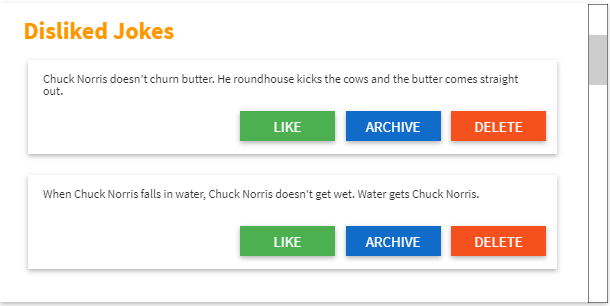

# Coding a Vision - Angular Course 2020
## Final Evaluation Project
---

### Resources

[The Internet Cuck Norris Database](http://www.icndb.com/api/) - Use the [http://api.icndb.com/jokes/random](Fetching a random joke API).

### Mockups

### Requirements
1. Use the Official Angular Material library
2. The ***Liked Jokes***, ***Disliked Jokes*** and the ***Archived*** sections must have a vertical scrollbar
3. You are free to use any helper CSS library or raw CSS if you prefer it, as far as the UI is  pleasant to the eyes.

---

## Task detail

### Chuck Norris Joke Section

This component uses a Material Card component and it is composed from 4 sub-sections:

- ***A title***
- ***A section to configure the fetch section time***
  This component will be using the Cuck Norris Database Random API (see the reference link) in order to retrieve the jokes and the fetch time section will configure the retrieval time of the jokes from the API.
  For example, let's suppose that the default fetch time is set to 30 seconds so each joke will be updated every 30 seconds but as soon as I change the fetch time, let's say to 5 seconds, the component should immediately update the fetch time and each joke should be updated every 5 seconds.
- ***A vote section***
   Below we have a voting section with two icons to ***like*** or ***dislike*** a joke. When a joke has been liked, it should be added to the ***Liked Jokes*** section. Conversely, when a joke has been disliked, it should be added to the ***Disliked Jokes*** section.
- ***Joke Content***
  Here it will be shown the joke content retrieved from the API.

---

### The other components

As you can see from the mockups, all these components have a very similar shape.

|                                                             |                                                              |                                                              |
| ----------------------------------------------------------- | ------------------------------------------------------------ | ------------------------------------------------------------ |
|  |  |  |

Each of them is composed by a material card with a title and a list of card containing the joke.

Each card containing the joke change slightly based on the parent component. For the Liked Jokes and Disliked Jokes are basically the same apart for the ***LIKE/DISLIKE*** button, apart from that one both of them have two other buttons to archive the joke and delete it.
When a joke gets archived, must disappear from the current section and be moved into the ***Archived Joke*** section.

Jokes that are in the ***Archived Joke*** section don't have any possible action associated with it in fact there isn't any action button.

---

### Final Notes

***You have 4 hours to finish the task***. Before the end of the 4 hours you should push your work on Github and provide to the instructor the link to the repo or alternatively provide a compress file of your repo (in this case you ***must delete*** the `node_modules` folder before submitting the compressed file).

*No other commits should be made once the project has been submitted.*

#### IN NO CASE, IT IS ALLOWED TO COLLABORATE WITH YOUR COLLEAGUES DURING THE TEST!

---

### Tips for you!!!

Read very carefully this document in order to understand the task specifications and if you have any doubt, ask your instructor and ***do not assume*** that things are as you think they are!

Before start coding, spend some time thinking about the modules/components/services you may need in order to finish the task.

***Planning is healthy, over planning is unhealthy!***

During you thinking/planning, understand that there is the need for some priority meaning, working on the ***Liked Jokes*** section (for example) without having retrieved the jokes ***does not make any sense*** so try to understand what the priorities are and proceed accordingly.

***DO NOT MAKE THE SAME MISTAKES AS IN THE FIRST EVALUATION!*** 
Start working on many things and not have even one single functionality fully working won't result in a positive evaluation. Procced wisely and make sub-functionality fully working before moving on other parts.

#### ENJOY YOUR TEST :)

---